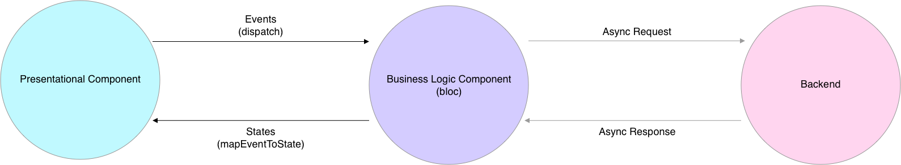

== State Management

The problem is that the application needs the same state in different locations. One way to solve
this is to pass down the state through the constructor. This solution is not scalable and it
can get really messy. Most common solutions are listed here: https://flutter.dev/docs/development/data-and-backend/state-mgmt/options

=== Inherited Widget

An Inherited Widget acts like a root widget, which can be accessed from every other widget. It doesn't matter
how deep it is in the widget tree.

Here is a awesome video explanation to Inherited Widget: https://www.youtube.com/watch?v=Zbm3hjPjQMk

=== Provider & Scoped Model

This solution is build on top of Inherited Widget and adds some additional functionality.

For more information visit this awesome blog post: https://fluttercrashcourse.com/blog/scoped-model-goto

<<<

=== Redux

[quote, Xavi Rigau]
Redux is a unidirectional data flow architecture that makes it easy to develop, maintain and test applications.

.Redux Data Flow
image::../images/redux-architecture.png[link="https://blog.novoda.com/introduction-to-redux-in-flutter/"]

For more information visit this awesome blog post: +
https://blog.novoda.com/introduction-to-redux-in-flutter/

=== BLoC / Rx

.BLoC Pattern

Here is a detailed blog post on how BLoC works: +
https://www.didierboelens.com/2018/08/reactive-programming---streams---bloc/

=== MobX

[quote, https://mobx.pub]
MobX is a state-management library that makes it simple to connect the reactive data of your application with the UI (or any observer). This wiring is completely automatic and feels very natural. As the application-developer, you focus purely on what reactive-data needs to be consumed in the UI (and elsewhere) without worrying about keeping the two in sync.
 +
 +
It's not really magic but it does have some smarts around what is being consumed (observables) and where (reactions), and automatically tracks it for you. When the observables change, all reactions are re-run. What's interesting is that these reactions can be anything from a simple console log, a network call to re-rendering the UI.

.MobX Core Concept
image::../images/mobx-triad.png[link="https://pub.dev/packages/mobx"]